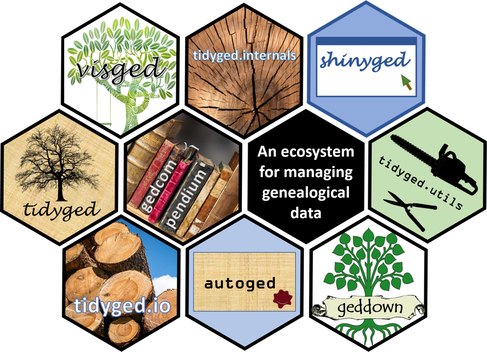

<!-- README.md is generated from README.Rmd. Please edit that file -->

# tidyged.utils 

<!-- badges: start -->

[](https://github.com/jl5000/tidyged.utils/actions)
[](https://codecov.io/gh/jl5000/tidyged.utils)
[](https://www.codefactor.io/repository/github/jl5000/tidyged.utils)
[](https://www.tidyverse.org/lifecycle/#experimental)
<!-- badges: end -->

Various utilities to maintain and clean family tree GEDCOM files.

The package is part of the `gedcompendium` ecosystem of packages. This
ecosystem enables the handling of `tidyged` objects (tibble
representations of GEDCOM files), and the main package of this ecosystem
is [`tidyged`](https://jl5000.github.io/tidyged/).


<br> For an introduction to GEDCOM files, head to the
<a href="https://jl5000.github.io/tidyged/articles/intro_to_gedcom.html">website</a>.

## Installation

You can install the development version from
[GitHub](https://github.com/) with:

``` r
# install.packages("devtools")
devtools::install_github("jl5000/tidyged.utils")
```

## Features

GEDCOM files can get very large and unwieldy, resulting in
inefficiencies and file bloat. The `tidyged.utils` package offers
functions to automate the cleaning and handling of GEDCOM files. It
includes:

  - Removal of ‘change date’ structures
  - Consolidating duplicate notes
  - Finding unreferenced records
  - Splitting files
  - Merging files

## Change dates

All top level records in a GEDCOM file can record the date and time they
were last modified. The `tidyged` package (the main package for creating
and summarising GEDCOM files) includes change dates (today’s date) by
default every time a record is created or modified. Since the time is
very unlikely to be useful in such a context, the package ignores this
by default. We illustrate by loading the `tidyged` and `tidyged.utils`
packages, and creating an example object.

``` r
library(tidyged)
library(tidyged.utils)

gedcom(subm("Me")) %>% 
  knitr::kable()
```

| level | record | tag   | value                                    |
| ----: | :----- | :---- | :--------------------------------------- |
|     0 | HD     | HEAD  |                                          |
|     1 | HD     | GEDC  |                                          |
|     2 | HD     | VERS  | 5.5.5                                    |
|     2 | HD     | FORM  | LINEAGE-LINKED                           |
|     3 | HD     | VERS  | 5.5.5                                    |
|     1 | HD     | CHAR  | UTF-8                                    |
|     1 | HD     | DEST  | tidyged                                  |
|     1 | HD     | SOUR  | tidyged                                  |
|     2 | HD     | VERS  | 0.0.0                                    |
|     2 | HD     | NAME  | The ‘tidyged’ package for the R language |
|     2 | HD     | CORP  | Jamie Lendrum                            |
|     3 | HD     | ADDR  |                                          |
|     3 | HD     | EMAIL | <jalendrum@gmail.com>                    |
|     3 | HD     | WWW   | <https://jl5000.github.io/tidyged/>      |
|     1 | HD     | DATE  | 20 MAR 2021                              |
|     1 | HD     | LANG  | English                                  |
|     1 | HD     | SUBM  | @U1@                                     |
|     0 | @U1@   | SUBM  |                                          |
|     1 | @U1@   | NAME  | Me                                       |
|     1 | @U1@   | CHAN  |                                          |
|     2 | @U1@   | DATE  | 20 MAR 2021                              |
|     0 | TR     | TRLR  |                                          |

See row 20 and the row after for the change date for the submitter
record.

For GEDCOM files with thousands of records, including change dates can
add considerable bloat. For this reason it is possible to remove all
change date structures with the `remove_change_dates()` function:

``` r
gedcom(subm("Me")) %>% 
  remove_change_dates() %>% 
  knitr::kable()
```

| level | record | tag   | value                                    |
| ----: | :----- | :---- | :--------------------------------------- |
|     0 | HD     | HEAD  |                                          |
|     1 | HD     | GEDC  |                                          |
|     2 | HD     | VERS  | 5.5.5                                    |
|     2 | HD     | FORM  | LINEAGE-LINKED                           |
|     3 | HD     | VERS  | 5.5.5                                    |
|     1 | HD     | CHAR  | UTF-8                                    |
|     1 | HD     | DEST  | tidyged                                  |
|     1 | HD     | SOUR  | tidyged                                  |
|     2 | HD     | VERS  | 0.0.0                                    |
|     2 | HD     | NAME  | The ‘tidyged’ package for the R language |
|     2 | HD     | CORP  | Jamie Lendrum                            |
|     3 | HD     | ADDR  |                                          |
|     3 | HD     | EMAIL | <jalendrum@gmail.com>                    |
|     3 | HD     | WWW   | <https://jl5000.github.io/tidyged/>      |
|     1 | HD     | DATE  | 20 MAR 2021                              |
|     1 | HD     | LANG  | English                                  |
|     1 | HD     | SUBM  | @U1@                                     |
|     0 | @U1@   | SUBM  |                                          |
|     1 | @U1@   | NAME  | Me                                       |
|     0 | TR     | TRLR  |                                          |

## Duplicate notes

With all records and many subrecords, it’s possible to include custom
notes to augment the information provided. These can either be the notes
themselves, or a pointer to a top level Note record:

``` r
notes <- gedcom(subm("Me")) %>%
  add_note("This is a generic note.") %>% 
  add_indi(indi_notes = c("This is a bespoke note.", "This is a generic note.")) %>% 
  add_repo("My repository", repo_notes = c("This is a bespoke note.", "This is a generic note."))

knitr::kable(notes)
```

| level | record | tag   | value                                    |
| ----: | :----- | :---- | :--------------------------------------- |
|     0 | HD     | HEAD  |                                          |
|     1 | HD     | GEDC  |                                          |
|     2 | HD     | VERS  | 5.5.5                                    |
|     2 | HD     | FORM  | LINEAGE-LINKED                           |
|     3 | HD     | VERS  | 5.5.5                                    |
|     1 | HD     | CHAR  | UTF-8                                    |
|     1 | HD     | DEST  | tidyged                                  |
|     1 | HD     | SOUR  | tidyged                                  |
|     2 | HD     | VERS  | 0.0.0                                    |
|     2 | HD     | NAME  | The ‘tidyged’ package for the R language |
|     2 | HD     | CORP  | Jamie Lendrum                            |
|     3 | HD     | ADDR  |                                          |
|     3 | HD     | EMAIL | <jalendrum@gmail.com>                    |
|     3 | HD     | WWW   | <https://jl5000.github.io/tidyged/>      |
|     1 | HD     | DATE  | 20 MAR 2021                              |
|     1 | HD     | LANG  | English                                  |
|     1 | HD     | SUBM  | @U1@                                     |
|     0 | @U1@   | SUBM  |                                          |
|     1 | @U1@   | NAME  | Me                                       |
|     1 | @U1@   | CHAN  |                                          |
|     2 | @U1@   | DATE  | 20 MAR 2021                              |
|     0 | @N1@   | NOTE  | This is a generic note.                  |
|     1 | @N1@   | CHAN  |                                          |
|     2 | @N1@   | DATE  | 20 MAR 2021                              |
|     0 | @I1@   | INDI  |                                          |
|     1 | @I1@   | SEX   | U                                        |
|     1 | @I1@   | CHAN  |                                          |
|     2 | @I1@   | DATE  | 20 MAR 2021                              |
|     1 | @I1@   | NOTE  | This is a bespoke note.                  |
|     1 | @I1@   | NOTE  | This is a generic note.                  |
|     0 | @R1@   | REPO  |                                          |
|     1 | @R1@   | NAME  | My repository                            |
|     1 | @R1@   | NOTE  | This is a bespoke note.                  |
|     1 | @R1@   | NOTE  | This is a generic note.                  |
|     1 | @R1@   | CHAN  |                                          |
|     2 | @R1@   | DATE  | 20 MAR 2021                              |
|     0 | TR     | TRLR  |                                          |

In the above example, there is a generic note recorded in a top level
Note record. This same note message has been used for the individual and
repository defined, but they have been repeated rather than pointing to
the Note record. There is also a repeated bespoke note given in the
Individual and Repository records.

The `consolidate_notes()` function will simplify the file, replacing
note values with pointers to top level Note records (creating them if
necessary) if they are repeated:

``` r
consolidate_notes(notes) %>% 
  knitr::kable()
```

| level | record | tag   | value                                    |
| ----: | :----- | :---- | :--------------------------------------- |
|     0 | HD     | HEAD  |                                          |
|     1 | HD     | GEDC  |                                          |
|     2 | HD     | VERS  | 5.5.5                                    |
|     2 | HD     | FORM  | LINEAGE-LINKED                           |
|     3 | HD     | VERS  | 5.5.5                                    |
|     1 | HD     | CHAR  | UTF-8                                    |
|     1 | HD     | DEST  | tidyged                                  |
|     1 | HD     | SOUR  | tidyged                                  |
|     2 | HD     | VERS  | 0.0.0                                    |
|     2 | HD     | NAME  | The ‘tidyged’ package for the R language |
|     2 | HD     | CORP  | Jamie Lendrum                            |
|     3 | HD     | ADDR  |                                          |
|     3 | HD     | EMAIL | <jalendrum@gmail.com>                    |
|     3 | HD     | WWW   | <https://jl5000.github.io/tidyged/>      |
|     1 | HD     | DATE  | 20 MAR 2021                              |
|     1 | HD     | LANG  | English                                  |
|     1 | HD     | SUBM  | @U1@                                     |
|     0 | @U1@   | SUBM  |                                          |
|     1 | @U1@   | NAME  | Me                                       |
|     1 | @U1@   | CHAN  |                                          |
|     2 | @U1@   | DATE  | 20 MAR 2021                              |
|     0 | @N1@   | NOTE  | This is a generic note.                  |
|     1 | @N1@   | CHAN  |                                          |
|     2 | @N1@   | DATE  | 20 MAR 2021                              |
|     0 | @I1@   | INDI  |                                          |
|     1 | @I1@   | SEX   | U                                        |
|     1 | @I1@   | CHAN  |                                          |
|     2 | @I1@   | DATE  | 20 MAR 2021                              |
|     1 | @I1@   | NOTE  | @N2@                                     |
|     1 | @I1@   | NOTE  | @N1@                                     |
|     0 | @R1@   | REPO  |                                          |
|     1 | @R1@   | NAME  | My repository                            |
|     1 | @R1@   | NOTE  | @N2@                                     |
|     1 | @R1@   | NOTE  | @N1@                                     |
|     1 | @R1@   | CHAN  |                                          |
|     2 | @R1@   | DATE  | 20 MAR 2021                              |
|     0 | @N2@   | NOTE  | This is a bespoke note.                  |
|     1 | @N2@   | CHAN  |                                          |
|     2 | @N2@   | DATE  | 20 MAR 2021                              |
|     0 | TR     | TRLR  |                                          |

## Unreferenced records

If there are any records that are not referenced anywhere else, they can
be found with the `identify_unused_records()` function. In the example
below we create 6 family group records, half with members, half without,
and also an unreferenced Repository record:

``` r
some_unref <- gedcom(subm("Me")) %>% 
  add_indi(qn = "Tom Smith") %>% 
  add_indi(qn = "Tammy Smith") %>% 
  add_indi(qn = "Alice White") %>% 
  add_indi(qn = "Phil Brown") %>% 
  add_famg(husband = "Tom", wife = "Tammy") %>% 
  add_famg() %>% 
  add_famg(husband = "Phil") %>% 
  add_famg() %>% 
  add_famg(children = "Alice") %>% 
  add_famg() %>% 
  add_repo("Test repo") 
  
identify_unused_records(some_unref)
#> [1] "@F2@" "@F4@" "@F6@" "@R1@"
```

We can find out more about these xrefs by using the `describe_records()`
function from the `tidyged` package:

``` r
identify_unused_records(some_unref) %>% 
  describe_records(gedcom = some_unref)
#> [1] "Family @F2@, headed by no individuals, and no children"
#> [2] "Family @F4@, headed by no individuals, and no children"
#> [3] "Family @F6@, headed by no individuals, and no children"
#> [4] "Repository @R1@, Test repo"
```
